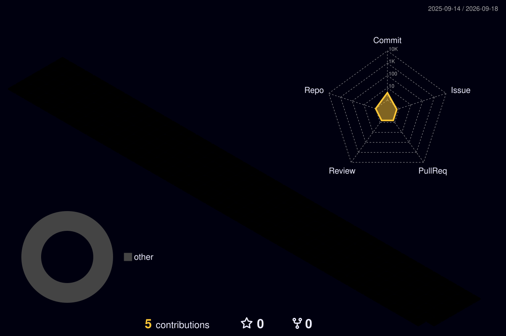

# Setup Guide

## 1. Create the profile repository

Go to <https://github.com/new> and name the repo **exactly** `Arshad00006` — identical to your username, case-sensitive. GitHub will show a "you found a secret" message. Set it to **Public** and tick *Add a README file*.

## 2. Add the files

Your repo should end up looking like this:

```
Arshad00006/
├── README.md
├── assets/
│   ├── header.svg
│   └── tech-stack.svg
└── .github/
    └── workflows/
        ├── snake.yml
        └── profile-3d.yml        (optional)
```

Easiest method — drag and drop:

1. Open your repo → **Add file → Upload files**
2. Drag the whole `assets` folder in, commit
3. Repeat for `.github` (if drag-and-drop skips it because it's a hidden folder, use **Add file → Create new file** and type `.github/workflows/snake.yml` as the filename — typing slashes creates the folders)
4. Open `README.md` → pencil icon → select all → paste the new content → commit

## 3. Fill in the placeholders

Search the README for `[ ` and replace every bracketed item:

- University name, school name, graduation years, CGPA
- Email address (appears twice — the YAML block and the Email badge)
- LeetCode / GeeksforGeeks / HackerRank / CodeChef usernames
- LinkedIn, X, Instagram handles
- Résumé link
- `[ REPO_NAME ]` and `[ REPO_NAME_2 ]` in the Featured Projects pins
- Project names and descriptions in the table

The LeetCode card at `leetcard.jacoblin.cool/...` stays blank until a real username is in the URL.

## 4. Turn on the snake animation

1. Repo → **Settings → Actions → General → Workflow permissions** → select **Read and write permissions** → Save. *(Do this first — it's the number one reason the workflow fails.)*
2. Repo → **Actions** tab → if prompted, click *I understand my workflows, go ahead and enable them*
3. Select **Generate Contribution Snake** → **Run workflow**
4. Wait ~60 seconds. It creates an `output` branch containing the two SVGs, and the snake starts rendering. It refreshes itself every 12 hours from then on.

## 5. Optional — 3D contribution calendar

Same process with `profile-3d.yml`. After its first successful run, add this anywhere in the README:

```markdown

```

---

# Fixing broken cards

## Why they break

`github-readme-stats`, `github-profile-trophy`, `github-readme-activity-graph` and `github-profile-summary-cards` are all open-source projects whose authors host one free public demo server. Every GitHub profile on earth that copy-pastes those URLs hits that single server, which shares one GitHub API key with a limit of 5,000 requests per hour. It blows past that limit constantly, and when it does, your card renders blank or shows "Maximum retries exceeded".

**Nothing is wrong with your README.** The fix is to run your own copy, which gets its own private rate limit that you alone use. It's free and takes about five minutes per service.

## The fix: deploy your own instance

Do this for `github-readme-stats` first — it powers the three most visible cards.

### Step 1 — Create a GitHub token

1. Go to <https://github.com/settings/tokens?type=beta> → **Generate new token**
2. Name: `readme-stats`, Expiration: **No expiration**
3. Repository access: **Public repositories** (read-only is enough)
4. Generate, then **copy the token immediately** — GitHub shows it once

### Step 2 — Deploy to Vercel

1. Sign up at <https://vercel.com> with your GitHub account (free tier is plenty)
2. Go to <https://github.com/anuraghazra/github-readme-stats> → click **Fork**
3. In Vercel: **Add New → Project** → import your fork
4. Before clicking Deploy, open **Environment Variables** and add:
   - Name: `PAT_1`
   - Value: the token you copied
5. Deploy. You'll get a URL like `https://github-readme-stats-arshad.vercel.app`

### Step 3 — Swap the domain in your README

Find-and-replace across the README file:

```
github-readme-stats.vercel.app  →  your-own-domain.vercel.app
```

Every stats card, top-languages card and pinned-repo card now runs off your own instance and will effectively never fail.

### Repeat for the others (same pattern)

| Card | Fork this repo |
|:---|:---|
| Trophies | <https://github.com/ryo-ma/github-profile-trophy> |
| Activity graph | <https://github.com/Ashutosh00710/github-readme-activity-graph> |
| Summary cards | <https://github.com/vn7n24fzkq/github-profile-summary-cards> |

Each one deploys to Vercel the same way. The trophy and activity-graph projects use an env var named `GITHUB_TOKEN` rather than `PAT_1` — check the repo's own README for the exact name.

## Things you don't need to fix

These are served by dedicated, stable infrastructure and are safe to leave as-is:

- `assets/header.svg` and `assets/tech-stack.svg` — hosted in your own repo, zero dependencies
- `streak-stats.demolab.com` — official hosted instance, reliable
- `readme-typing-svg.demolab.com` — same
- `img.shields.io` — enterprise-grade, effectively never down
- `komarev.com/ghpvc` — dedicated host
- `ghchart.rshah.org` — tiny service, very stable
- `raw.githubusercontent.com` — GitHub itself

## Card still blank after all that?

- **GitHub caches images aggressively.** Hard-refresh with `Ctrl + Shift + R`, or append `&v=2` to the image URL to bust the cache.
- **Check the URL directly.** Paste the image `src` into a browser tab. If it errors there, it's the service, not your README.
- **Private-contribution counts** need `count_private=true` *and* Settings → Profile → *Include private contributions on my profile* enabled.
